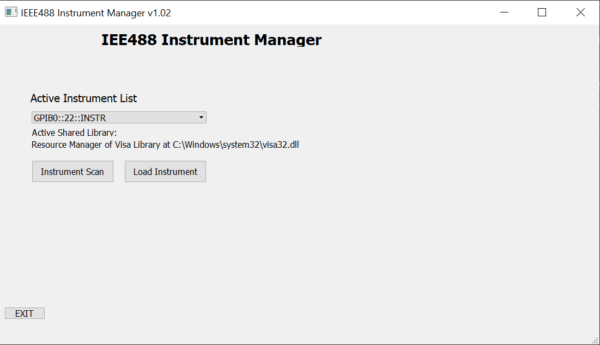
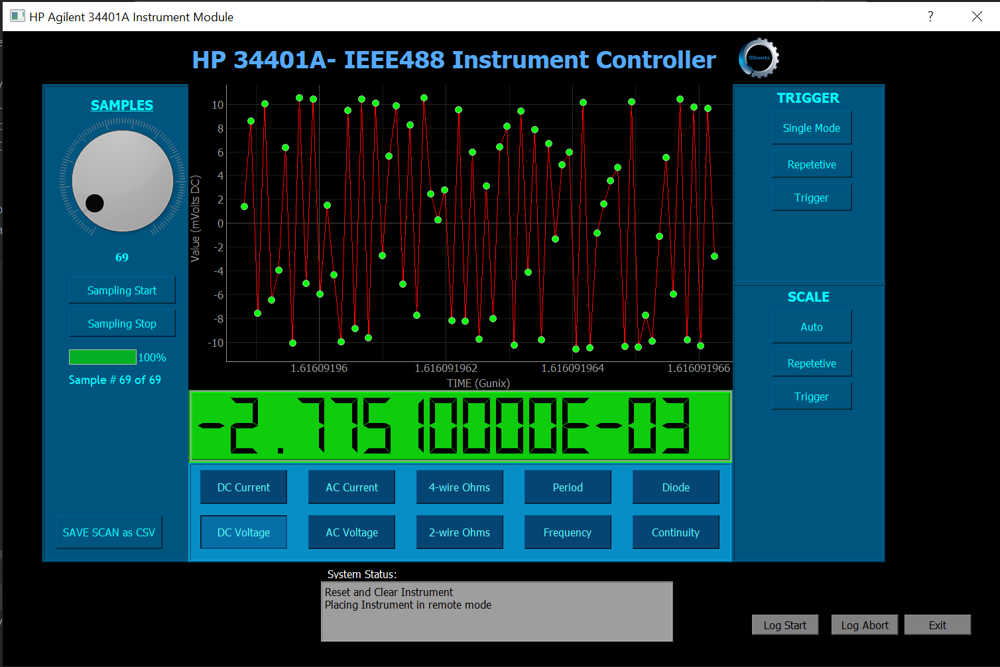

# IEEE488_Instrument_Manager_PyQt5
Python PyQt5 pyvisa Instrument Manager/Controller

This is a work in progress. This repo builds out a IEEE488 -1, -2 variants instrument controller

Currently undergoing an architectural change to make additional instruments less onerous.

THIS CODE IS NOT CURRENTLY IN A STATE FOR RELEASE

This codebase runs on Python 3.7++
Uses following Libs:

PyQT5 version 5.9.2, pyvisa 1.11.3, pyqtgraph 0.11.0
The rest is just latest.

This version functions as a frontend for communicating with IEE488 connected devices. From a host standpoint,
you'll need a hardware USB-GPIB bridge (NI or Agilent supported). Note the Prologix adapter is NOT compatible 
with this code release. You will also need to have the VISA32.DLL installed on the host machine. I recommend 
the NI version to maintain compatibility.

The core software runs under the PyQt5 framework for GUI support, pyvisa for IEEE488 control, and pyqtgraph
for data presentation. This release supports a single HP34401A dialog window at GPIB addr 22 for test purposes.

MAIN WINDOW INSTRUMENT SELECTOR

INSTRUMENT DIALOG WINDOW
